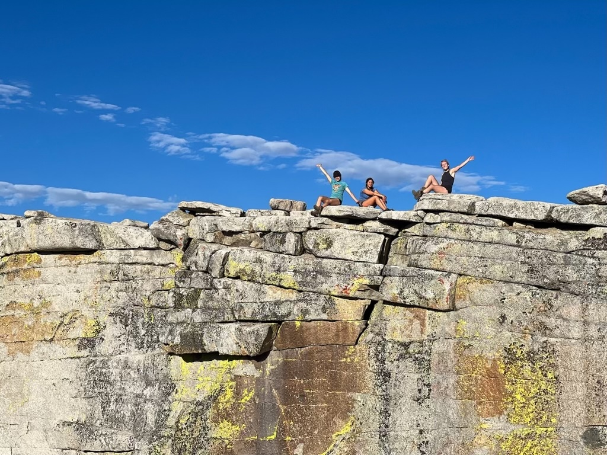
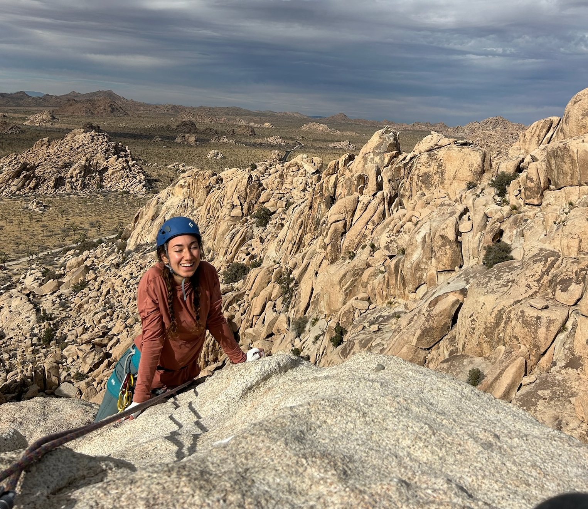
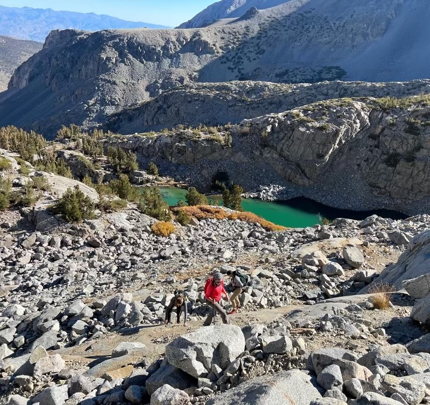
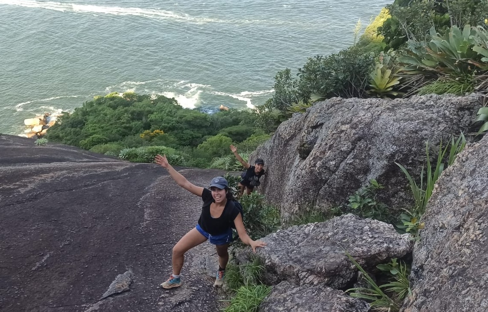

Here are some photos from trekking, climbing, and travels. Last year, I spent 5 months in South America, trekking, traveling, chatting with locals about South American politics, and working on my trade secrecy research paper. This year, I hope to climb more in the Sierras and bring more young women into the outdoors!

## Trekking

  

    
    
Lee Vining with my nine housemates!

  

  

    
    
On the top of Half Dome

  

## Climbing/Mountains

  

    
    
After my first off-width climb– Joshua Tree, CA

  

  

    
    
Middle Palisade, 14er in CA

  

  

    
    
Mt Conness, 3rd class route

  

## South America

  

    
    
Scaling Pao de Azucar with friends

  

  

    
    
Refugio Frey outside of Bariloche, Argentina

  

